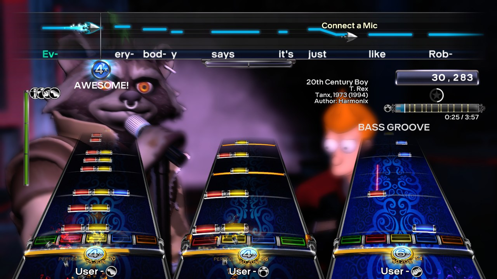
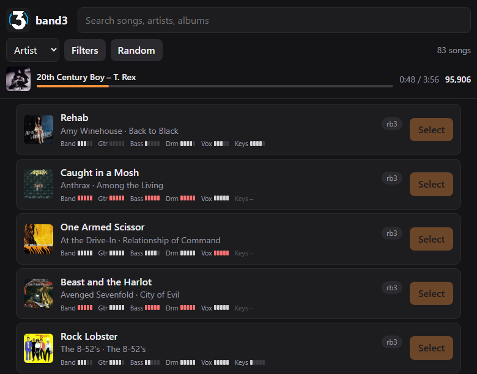

# slopband3 - An AI assisted band3_recomp experiment

A static recompilation of Rock Band 3 (Xbox 360, Title Update 5, or Rock Band 3 Deluxe)
into a native PC game, built on the [ReXGlue SDK](https://github.com/rexglue/rexglue-sdk).
Playable, still a work in progress.



This is a fork of [ihatecompvir/band3_recomp](https://github.com/ihatecompvir/band3_recomp).
Everything it adds was written with the help of AI, which did the vast majority of the
work. I wanted something I could keep on my Steam Deck/laptop so I didn't have to lug my
360 to parties anymore. There are other recomp projects that have not utilized AI as much
as this one has, if you'd rather go with one of those. This one was put together by me with
features I wanted to see and use, for my personal use. If you like it, awesome. If not, I
get it and don't blame you at all. Either way, rock on.

You need your own copy of the game; no game files are included. RB3 Deluxe is highly recommended.

## Features

**Playing**
- Local multiplayer: up to four players, each controller its own player
- DLC and custom songs (`CON`/`LIVE`/`PIRS`) read straight from folders, nothing to install
- Rock Band 3 Deluxe support
- The display's refresh rate, high ones included (`frame_cap`), a forced venue, song and highway speed
- Steam Deck defaults: fullscreen, letterboxed, vsync

**Instruments**
- Xbox 360 instruments and gamepads, through SDL or XInput
- PS3, Wii, PS4 and PS5 Rock Band guitars and drums through their USB dongles (experimental)
- Electronic drum kits over MIDI, played as pro drums without a MIDI Pro Adapter
- USB microphones, including harmonies (experimental)
- Pro Keys and Pro Guitar data (untested)
- Per-type controller lag, and the **Instrument Lab** (F6): a virtual instrument and a view of what the game reads from each one

**Integrations** (RB3Enhanced-compatible)
- Network events over UDP: Stage Kit lighting, song, band and venue info
- A web page for browsing the song library from a phone and picking the next song, plus RB3Enhanced's web API
- Searching [RhythmVerse](https://rhythmverse.co) for custom songs from that page, and downloading them into the game without a restart
- RB3Enhanced's script functions, modifiers and unlock options, so Deluxe's RB3E features work
- RB3Enhanced's song source icons in the song list, from Deluxe's icons
- Rock Central's online features (leaderboards, Battles) through [GoCentral](https://github.com/ihatecompvir/GoCentral), as RB3Enhanced connects
- Online play without Xbox Live, straight to another player's game, as RB3Enhanced's Liveless does, or by code through RB3Enhanced's Liveless Rooms (F10)
- Discord Rich Presence



**Settings**
- A launcher: a setup screen for folders, graphics, audio, controllers and online features, shown on the first run (Shift at startup brings it back on Windows)
- An in-game settings menu (F4, or both stick clicks), saved to `band3.toml`
- Configurable save, cache and song folders, including a portable install

**Graphics**
- A native renderer, the default on Windows, with no emulated Xbox 360 GPU at all. band3
  draws each frame itself with the game's own shaders, checked against the emulated GPU's
  picture pixel by pixel. One setting, `renderer`, picks what draws the picture: `native`,
  `emulated` (the emulated GPU alone; the default on Linux until the native renderer has
  been run there) or `both`, "Native + emulated (debug)", where F8 switches between their
  pictures. F9 opens the native renderer's debug view.
  - Faster: uncapped, 257 fps in the main menu and 285 in a song with the emulated GPU
    still beside it, against 165 and 163 on the emulated GPU (about 1.6 to 1.75 times).
    Without it, at 60 Hz in a song, the GPU is 13 % busy against 22 % beside it and 28 % on
    the emulated GPU alone, and uses about 800 MB of video memory against 1.4 GB beside it
  - Sharper: it draws at the window's size, 1080p or 4K, where the emulated GPU draws the
    console's 720p unless `resolution_scale` is raised, at a high GPU cost
  - Native alone has run on Windows (Direct3D 12); its Vulkan path for Linux is written
    but untested
  - [Native renderer](docs/native-renderer.md) has the details, the settings and what still
    differs (the lens flares aren't occluded, as on the emulated GPU; the store and RB3's
    error screens aren't checked)

**Development**
- A scriptable test harness, render checks against the game's own picture, unit tests and CI
- Tracy profiling zones on RB3's engine systems

## Quick start

1. Get the [ReXGlue SDK nightly-20260925-5cf287f4](https://github.com/rexglue/rexglue-sdk/releases/tag/nightly-20260925-5cf287f4)
   and unpack its platform folder to `.rexglue-sdk` in the repository root.
2. Put the game's `default.xex` and `gen` folder (with the `main` and `patch` ARKs) in `assets/`.
3. Build (Windows, from a Visual Studio developer prompt):
   ```
   rexglue codegen band3_manifest.toml
   cmake --preset win-amd64-release
   cmake --build --preset win-amd64-release
   ```

See [Building](docs/building.md) for the full requirements, the Linux steps, the checks
CI runs and profiling.

## Documentation

| | |
|---|---|
| [Building](docs/building.md) | requirements, Windows and Linux builds, unit tests, compile check, profiling |
| [Settings, folders and songs](docs/settings.md) | the launcher, the F4 menu, config files, where band3 keeps things, DLC and custom songs, loose-file mods, Steam Deck |
| [Instruments and microphones](docs/instruments.md) | Instrument Lab, PlayStation/Wii dongles, MIDI drums, USB mics, pro instruments, controller lag |
| [Integrations](docs/integrations.md) | network events, Discord, the web server and its API, GoCentral, Liveless online play, RB3Enhanced and Deluxe compatibility |
| [Test harness](docs/test-harness.md) | `band3ctl`: driving the game from scripts, and the game tests |
| [Native renderer](docs/native-renderer.md) | the native renderer, render checks, capture replay and parity measurement |

`band3_config.ini` documents every option band3 reads.

## band3 and milo-native-engine

[milo-native-engine](https://github.com/freeqaz/milo-native-engine) takes the other route
to a native Rock Band 3: a port. Decompiled source (rb3-xenon's, for the Xbox 360 version)
is rebuilt as native 64-bit C++ and linked against a shared engine that renders with WebGPU
and provides audio, input and file access. band3 instead runs the game's own executable,
statically recompiled.

| | band3 | milo-native-engine |
|---|---|---|
| Game code | the Xbox 360 executable, recompiled from PowerPC; it runs in an emulated 32-bit address space, on ReXGlue's implementation of the Xbox kernel | the decompiled source, rebuilt as native 64-bit C++ |
| What it needs | only the executable: every function runs, decompiled or not | a complete, working decompilation |
| Rendering | a native renderer, which reproduces the game's own shaders and is checked against the game's picture pixel by pixel; it will replace the emulated Xbox 360 GPU\* | WebGPU, with shaders of its own |
| Platforms | wherever ReXGlue runs: Windows and Linux | Windows, Linux, Mac and the web |
| Pros | playable now; the whole game runs as it shipped, so gameplay, timing, DLC and Deluxe behave as on a 360; the picture aims to match the 360's exactly | runs anywhere, the web included; the game can be changed at the source; no emulation layer, and ordinary C++ to debug |
| Cons | the emulated address space and kernel stay; changing the game means hooking recompiled functions; limited to ReXGlue's platforms | playable only once the decompilation is complete; the game behaves as the original only where the decompilation matches it; its own shaders don't reproduce the 360's picture |

Both renderers replace the same part of RB3, its platform render layer (`DxRnd`, `DxMesh`,
`DxTex`), and draw the same Milo meshes, materials and cameras. The difference is everything
around them.

\* Partly done. The native renderer draws the picture by default on Windows, with no
emulated GPU (`renderer` native); the emulated GPU stays the default on Linux until the
native renderer has been run there. `renderer` both runs the two side by side, F8 switching
between their pictures, to compare them.

## Credits

band3 stands on the work of these projects:

**Recompilation**
- [band3_recomp](https://github.com/ihatecompvir/band3_recomp) by ihatecompvir and its
  contributors: the original Rock Band 3 recompilation this fork builds on.
- [ReXGlue SDK](https://github.com/rexglue/rexglue-sdk): the Xbox 360 recompiler and
  runtime band3 is built with.

**Decompilations**
- [rb3-xenon](https://github.com/freeqaz/rb3-xenon) by freeqaz: a decompilation of the
  same Xbox 360 TU5 executable. band3's function names are imported from its symbol map
  (`tools/import_rb3xenon_names.py`), and its source is the reference for band3's hooks,
  instrument handling and renderer.
- [dc3-decomp](https://github.com/rjkiv/dc3-decomp), the MiloHax decompilation of Dance
  Central 3: the source of rb3-xenon's Milo engine code.
- [rb3](https://github.com/DarkRTA/rb3), the decompilation of the Wii version of Rock
  Band 3: the source of rb3-xenon's game code.
- [milo-native-engine](https://github.com/freeqaz/milo-native-engine) by freeqaz: a
  reference for the native renderer.

**Rock Band community**
- [RB3Enhanced](https://github.com/RBEnhanced/RB3Enhanced): band3 follows its network
  event format, web API, script functions, modifiers and custom song IDs.
- [Rock Band 3 Deluxe](https://github.com/hmxmilohax/rock-band-3-deluxe) by MiloHax.
- [PlasticBand](https://github.com/TheNathannator/PlasticBand) and
  [PlasticBand-Unity](https://github.com/TheNathannator/PlasticBand-Unity) by
  TheNathannator: the documentation behind band3's Xbox 360, PlayStation and Wii
  instrument support.

**Emulators**
- [RPCS3](https://github.com/RPCS3/rpcs3): band3's MIDI drum support is adapted from its
  emulated MIDI Pro Adapter.
- [Xenia](https://github.com/xenia-canary/xenia-canary): the native renderer reads
  textures, mip tails and the gamma ramp as Xenia does, and the shader research tools
  read its ucode dumps.

**Libraries**
- [RtMidi](https://github.com/thestk/rtmidi) (MIDI input),
  [inih](https://github.com/benhoyt/inih) (INI parsing),
  [miniupnpc](https://github.com/miniupnp/miniupnp) (UPnP port mapping),
  [stb_image_write](https://github.com/nothings/stb) (album art),
  [doctest](https://github.com/doctest/doctest) (unit tests),
  [Tracy](https://github.com/wolfpld/tracy) (profiling), and SDL3 through the ReXGlue SDK.

Rock Band 3 is a trademark of Harmonix Music Systems. This project is not affiliated with
or endorsed by Harmonix, MTV Games or Microsoft.

## License

[GPL-2.0](LICENSE.md).
