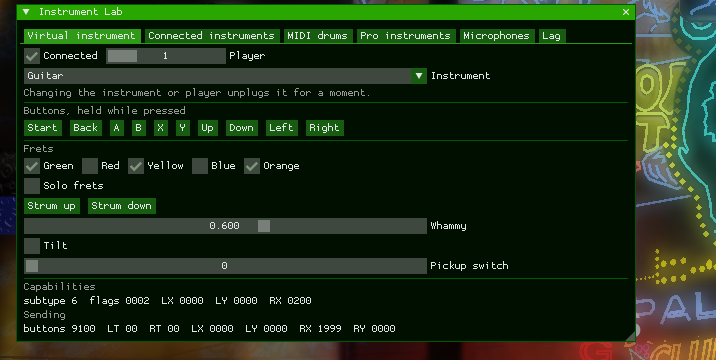

# Instruments and microphones

Controllers are read through SDL by default, or through XInput on Windows with
`input_backend = xinput`. Each controller is its own player, up to four. Gamepads and the
keyboard play as `controller_type` (a guitar by default); real Xbox 360 instruments keep
their own type.

## Instrument Lab

Press **F6** to open the Instrument Lab. It connects a virtual Xbox 360 instrument
(guitar, drums, keys, or a Mustang or Squier pro guitar) as its own player (player 2
by default) and plays it with the mouse, showing the exact data it sends. It is a tool
for checking how the game reads each instrument without the hardware. Its other tabs
(Connected instruments, MIDI drums, Microphones, Pro instruments, Lag) are described
below.

## PlayStation and Wii instruments (experimental)

Turn on `hid_instruments` (F4, Band3 → Game, then restart) to play Rock Band guitars and
drum kits through their USB dongles:

- PS3 and Wii guitars and drum kits, and a PS3 or Wii MIDI Pro Adapter in drum mode
- PS4 guitars (MadCatz Stratocaster, PDP Jaguar) and drum kits (MadCatz, PDP)
- PDP Riffmaster and CRKD Gibson SG, in PS4 or PS5 mode

They show up as Xbox 360 instruments, each as its own player. This is new and hasn't been
tried on every model yet. The Instrument Lab's **Connected instruments** tab shows each
one's raw reports next to what the game receives; if one misbehaves, press **Save a 5
second capture** while playing the part that goes wrong, and include the file it writes
to `logs/` (next to the executable) with the report.

On Linux the dongles need to be readable by your user; install
`tools/linux/70-band3-rock-band-instruments.rules` as described at the top of that file.

The report layouts come from [PlasticBand](https://github.com/TheNathannator/PlasticBand)'s
documentation, cross-checked against
[PlasticBand-Unity](https://github.com/TheNathannator/PlasticBand-Unity).

## MIDI drum kits

Turn on `midi_drums` (F4, Band3 → MIDI drums, then restart) to play an electronic drum kit
over MIDI as a Rock Band pro drum kit, without a MIDI Pro Adapter. It uses the first MIDI
input unless `midi_drums_device` names one (or part of one's name), and picks up a kit
plugged in after the game starts.

This is adapted from [RPCS3](https://github.com/RPCS3/rpcs3)'s emulated MIDI Pro Adapter.
Notes follow the adapter's layout: snare 38, toms 48/45/41, hi-hat 42/46, ride 51, crash
49, kick 36, hi-hat pedal 44 (the second pedal). Change any of them with
`midi_drums_notes`, e.g. `44=Kick,40=Snare`, the same format as RPCS3's overrides. The
Instrument Lab's **MIDI drums** tab shows what each note you hit played.

The kit has no menu buttons, so as in RPCS3: hi-hat pedal three times then snare is Start,
then the rim is Select, and then kick holds the kick for the song category menu (snare or
floor tom lets go). Turn these off with `midi_drums_combos`.

## Microphones (experimental)

Turn on `usb_mics` (F4, Band3 → Microphones, then restart) to sing through microphones on
this PC as Xbox 360 USB microphones. The first mic slot uses the system's default
recording device unless `usb_mic_devices` names microphones (or parts of their names),
comma separated, one per slot, for harmonies. Microphones plugged in after the game starts
are picked up.

The game connects the mic, offers the vocal parts (Solo, Harmony) and scores what it hears
(tested with the test tone below; singing into a real microphone hasn't been scored in a
test yet). To check the game hears a mic slot without a microphone, set
`usb_mic_test_tone` to a pitch in Hz (e.g. 220): the first slot then sings that steady
tone, which the vocal track's pitch arrow holds. The Instrument Lab's **Microphones** tab
shows what records each slot, whether the game has connected it and how much audio it
has taken; the log reports the same steps (`USB mics: ...`).

## Pro Keys and Pro Guitar (untested)

RB3 reads a keytar's keys and a pro guitar's frets and strings through an Xbox 360 system
call that ReXGlue doesn't implement, so band3 hands the game that data itself, for any
keytar or pro guitar the input system reports: the Instrument Lab's, or a real one on
Windows with `input_backend = xinput`. This hasn't been run against the game yet; the
Instrument Lab's keys and pro guitars are the way to check it, and its **Pro instruments**
tab shows, per player, the instrument type the game sees and the bytes band3 gave it. Keep
the SDK's stick deadzones (`left_stick_deadzone_percentage`,
`right_stick_deadzone_percentage`) at 0, since these instruments send their keys and frets
in the stick values.

## Controller lag

On top of calibration, RB3 builds in extra lag for each controller type, from the Xbox
hardware's own delay (45 ms for an Xbox guitar, 36 ms for Xbox drums). band3's PlayStation,
Wii and MIDI instruments reach the game as Xbox ones, so they get those numbers too. The
Instrument Lab's **Lag** tab shows, per player, the type the game sees and the lag it
uses. `joypad_lag` (Band3 → Game, then restart) changes it per type, as `type=ms`, comma
separated: `5=20,8=30` gives Xbox guitars 20 ms and Xbox drums 30 ms. `type=ms/video/audio`
also sets the lag the calibration tests assume, and a blank part keeps the game's number
(`8=/30/`). It's per type, so a real Xbox instrument of the same type changes too.
